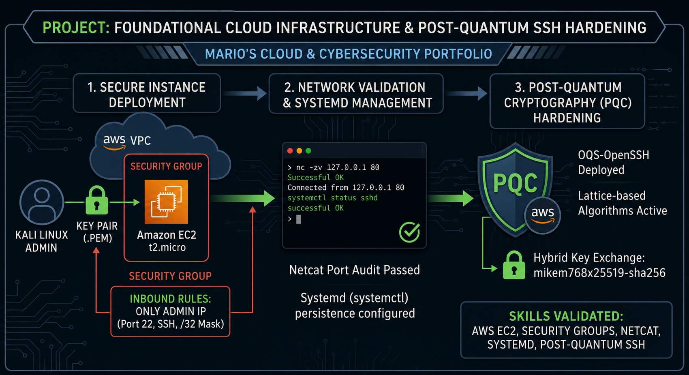

# 🚀 AWS Data Engineering & Cloud Security Journey

Welcome to my portfolio! This repository serves as the central hub for my preparation for the **AWS Certified Data Engineer - Associate (DEA-C01)** certification. Here, I document all my hands-on labs, architectural deployments, and security hardening procedures.

---

## 🔐 Lab 1: Foundational Cloud Infrastructure & Post-Quantum SSH Hardening

### 📋 Overview
In this foundational lab, I deployed a secure Linux instance on Amazon EC2, configured strict network access controls via Security Groups, performed network port auditing using Netcat, and hardened the remote access channel against future threats using **Post-Quantum Cryptography (PQC)**.

### 🏗️ Architecture Diagram

---

### 🛠️ Step-by-Step Implementation

#### Step 1: Secure EC2 Deployment & IAM Check
* Deployed an **Amazon Linux 2023** instance on AWS EC2.
* Configured an IAM-vetted Key Pair (`.pem`) for secure authentication.
* Restrained network access by applying the principle of least privilege on the AWS Security Group, allowing SSH traffic (Port 22) strictly from my administrator IP (`/32` mask).

#### Step 2: Service Management & Network Auditing
* Connected via SSH from my local Kali Linux environment.
* Installed and managed core system services using `systemd` (`systemctl`).
* Utilized **Netcat (`nc -zv`)** to perform proactive network troubleshooting, successfully mapping out `Connection refused` states to isolate and fix service downtimes.
* Configured service persistence using `systemctl enable` to guarantee high availability after system reboots.

#### Step 3: Post-Quantum Cryptography (PQC) Hardening
* Addressed the modern cryptographic threat known as **"Store Now, Decrypt Later"** (where adversaries intercept encrypted traffic today to decrypt it in the future using quantum computers).
* Upgraded the OpenSSH packages on both the client (Kali Linux) and the server (AWS EC2).
* Enforced the use of hybrid quantum-resistant key exchange algorithms (`mlkem768x25519-sha256`), eliminating standard handshake warnings and ensuring next-generation session defense.

---

### 🧠 Skills Validated
* **Cloud Infrastructure:** AWS EC2, Security Groups, Network Isolation (`/32` masking).
* **Linux Administration:** Systemd initialization, Package Management (`dnf`/`apt`), Session Logging.
* **Network Security:** Port scanning and diagnostics with Netcat (`nc`), OpenSSH tuning, Post-Quantum Cryptography (PQC).

---

## 📈 Next Phase: Data Engineering Core
With the secure infrastructure foundation established, the next module will cover **Data Ingestion and Storage**, focusing on:
* **Amazon S3** Data Lakes design and partitioning.
* **AWS IAM** fine-grained policies for data access.
* **Amazon Kinesis** real-time data streaming ingestion.

*Course followed: AWS Certified Data Engineer Associate 2026 by Stephane Maarek & Frank Kane.*

---

<b>🇧🇷 Clique aqui para ver a versão em Português (Portuguese Version)</b>

## 🔐 Laboratório 1: Infraestrutura de Nuvem e Segurança Avançada SSH

### 📋 Visão Geral
Neste laboratório prático de fundação, realizei o deploy de uma instância Linux segura no Amazon EC2, configurei controles estritos de acesso à rede por meio de Security Groups, executei auditoria de portas utilizando Netcat e blindei o canal de acesso remoto contra ameaças futuras aplicando **Criptografia Pós-Quântica (PQC)**.

### 🏗️ Diagrama de Arquitetura

---

### 🛠️ Implementação Passo a Passo

#### Passo 1: Implantação Segura da EC2 e Validação de IAM
* Implementação de uma instância **Amazon Linux 2023** no AWS EC2.
* Configuração de Key Pair (`.pem`) validada por IAM para autenticação segura.
* Restrição de acesso à rede aplicando o princípio do menor privilégio no Security Group da AWS, liberando o tráfego SSH (Porta 22) estritamente para o IP do administrador (máscara `/32`).

#### Passo 2: Gerenciamento de Serviços e Auditoria de Rede
* Conexão via SSH a partir do ambiente local Kali Linux.
* Instalação e gerenciamento de serviços essenciais do sistema operacional utilizando `systemd` (`systemctl`).
* Uso do **Netcat (`nc -zv`)** para execução de troubleshooting de rede proativo, mapeando estados de `Connection refused` para isolar e corrigir falhas de serviços.
* Configuração de persistência de serviços via `systemctl enable` para garantir alta disponibilidade pós-reboot.

#### Passo 3: Blindagem com Criptografia Pós-Quântica (PQC)
* Mitigação da ameaça criptográfica moderna conhecida como **"Store Now, Decrypt Later"** (onde atacantes interceptam tráfego criptografado hoje para decifrá-lo no futuro usando computadores quânticos).
* Atualização dos pacotes OpenSSH tanto no cliente (Kali Linux) quanto no servidor (AWS EC2).
* Imposição do uso de algoritmos de troca de chave híbridos resistentes a computação quântica (`mlkem768x25519-sha256`), eliminando alertas de handshake e garantindo a defesa da sessão para a próxima geração.

---

### 🧠 Habilidades Validadas
* **Infraestrutura em Nuvem:** AWS EC2, Security Groups, Isolamento de Rede (máscara `/32`).
* **Administração Linux:** Inicialização via Systemd, Gerenciamento de Pacotes (`dnf`/`apt`), Log de Sessão.
* **Segurança de Rede:** Varredura e diagnóstico de portas com Netcat (`nc`), tunelamento OpenSSH, Criptografia Pós-Quântica (PQC).

---

<b>🇧🇷 Clique aqui para ver a versão em Português (Portuguese Version)</b>

## 🔐 Laboratório 1: Infraestrutura de Nuvem e Segurança Avançada SSH

### 📋 Visão Geral
Neste laboratório prático de fundação, realizei o deploy de uma instância Linux segura no Amazon EC2, configurei controles estritos de acesso à rede por meio de Security Groups, executei auditoria de portas utilizando Netcat e blindei o canal de acesso remoto contra ameaças futuras aplicando **Criptografia Pós-Quântica (PQC)**.

### 🏗️ Diagrama de Arquitetura

---

### 🛠️ Implementação Passo a Passo

#### Passo 1: Implantação Segura da EC2 e Validação de IAM
* Implementação de uma instância **Amazon Linux 2023** no AWS EC2.
* Configuração de Key Pair (`.pem`) validada por IAM para autenticação segura.
* Restrição de acesso à rede aplicando o princípio do menor privilégio no Security Group da AWS, liberando o tráfego SSH (Porta 22) estritamente para o IP do administrador (máscara `/32`).

#### Passo 2: Gerenciamento de Serviços e Auditoria de Rede
* Conexão via SSH a partir do ambiente local Kali Linux.
* Instalação e gerenciamento de serviços essenciais do sistema operacional utilizando `systemd` (`systemctl`).
* Uso do **Netcat (`nc -zv`)** para execução de troubleshooting de rede proativo, mapeando estados de `Connection refused` para isolar e corrigir falhas de serviços.
* Configuração de persistência de serviços via `systemctl enable` para garantir alta disponibilidade pós-reboot.

#### Passo 3: Blindagem com Criptografia Pós-Quântica (PQC)
* Mitigação da ameaça criptográfica moderna conhecida como **"Store Now, Decrypt Later"** (onde atacantes interceptam tráfego criptografado hoje para decifrá-lo no futuro usando computadores quânticos).
* Atualização dos pacotes OpenSSH tanto no cliente (Kali Linux) quanto no servidor (AWS EC2).
* Imposição do uso de algoritmos de troca de chave híbridos resistentes a computação quântica (`mlkem768x25519-sha256`), eliminando alertas de handshake e garantindo a defesa da sessão para a próxima geração.

---

### 🧠 Habilidades Validadas
* **Infraestrutura em Nuvem:** AWS EC2, Security Groups, Isolamento de Rede (máscara `/32`).
* **Administração Linux:** Inicialização via Systemd, Gerenciamento de Pacotes (`dnf`/`apt`), Log de Sessão.
* **Segurança de Rede:** Varredura e diagnóstico de portas com Netcat (`nc`), tunelamento OpenSSH, Criptografia Pós-Quântica (PQC).

